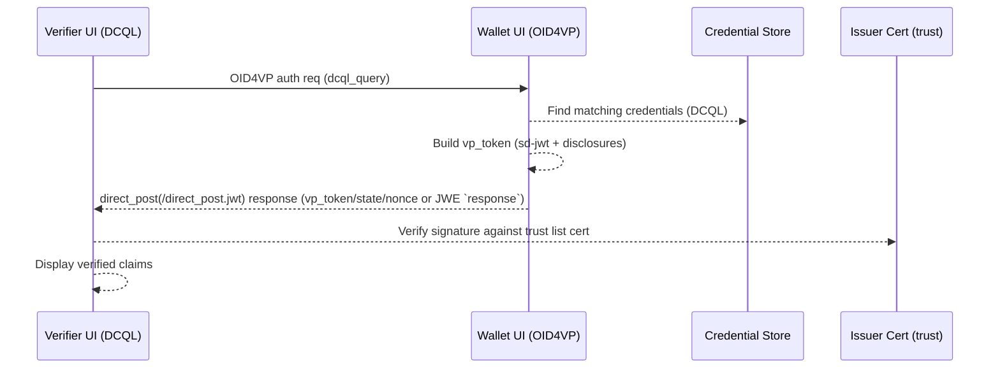

# EUDI Wallet Keycloak Demo

> **WARNING: This is a demo/prototype implementation for development and testing purposes only. It is NOT production-ready and should NOT be used in production environments. The code lacks security hardening, proper error handling, and has not undergone security audits. Use at your own risk.**

Spring Boot demo/mock of an EUDI wallet that authenticates against Keycloak 26.4.5 (with `oid4vc-vci` enabled), issues SD-JWT and mDoc credentials (Keycloak or the mock issuer), and stores them on the filesystem.  
It also exposes an OID4VP 1.0 “same device” presentation endpoint and a verifier UI that use DCQL (`dcql_query`) instead of legacy presentation definitions. SD-JWT and mDoc presentations are validated against the trust list.  
The sd-jwt and mdoc implementations live in reusable `sdjwt-lib` and `mdoc-lib` modules; the wallet, mock issuer, and verifier services depend on these libraries. The verifier can be pointed at any external wallet that implements the OID4VP 1.0/DCQL profile (for example a sandbox or a real mobile wallet) by switching `VERIFIER_WALLET_AUTH_ENDPOINT`.  
Integration tests spin up Keycloak in a Testcontainer and exercise the complete SD-JWT and mDoc issuance + presentation flow end-to-end.

## Credential formats: SD-JWT vs mDoc

- **SD-JWT (`dc+sd-jwt`)** – A signed JWT whose payload carries digests for selectively disclosable claims. Each hidden claim is sent as a Base64URL “disclosure” and the presentation string concatenates the signed JWT and every disclosure with `~`. Verifiers check the issuer signature, then recompute each digest to ensure the disclosures belong to the signed token.
- **mDoc/CBOR (`mso_mdoc`)** – ISO/IEC 18013-5 Mobile Security Objects. Every claim is an issuer-signed data element (`digestID`, 16-byte `random`, `elementIdentifier`, `elementValue`) encoded as tagged CBOR. The MSO contains SHA-256 `valueDigests` for each element plus `validityInfo`; a COSE_Sign1 (`issuerAuth`) signs the tagged MSO. `issuerSigned.nameSpaces` embeds the tagged elements that can be selectively disclosed.
- **Key differences** – SD-JWT is pure JSON/JWT with Base64URL disclosures; mDoc is CBOR/COSE with tagged elements and digests. Holder binding uses KB-JWT (`cnf`) for SD-JWT and `deviceKeyInfo` for mDoc. Presentations may be hex/base64 for mDoc, whereas SD-JWT stays URL-safe text.
- **Examples**
  - SD-JWT (presentation string):
    ```
    <signed-jwt>~<disclosure-1>~<disclosure-2>
    ```
  - mDoc (conceptual CBOR shape):
    ```
    {
      "version": "1.0",
      "documents": [{
        "docType": "org.iso.18013.5.1.mDL",
        "issuerSigned": {
          "nameSpaces": {
            "org.iso.18013.5.1": [
              h'D8184f'({ "digestID":0,"random":h'..',"elementIdentifier":"given_name","elementValue":"Alice" })
            ]
          },
          "issuerAuth": "COSE_Sign1(...)"
        }
      }]
    }
    ```
    `issuerAuth` decodes to the MSO with `valueDigests` (hashes of the tagged elements) and `validityInfo`, which the COSE signature protects.

 ## Prerequisites

 - Java 21+
 - Maven 3.9+
 - Docker (for Keycloak and integration tests)

## Running Keycloak

The repository contains a realm export under `demo-app/config/keycloak/realm-export.json` that configures:

- Realm `wallet-demo`
- Client `wallet-mock`
- Client scopes `mock-identity-credential`, `mock-alternate-credential`, and `pid-credential` (PID SD-JWT with core claims like name, birthdate, nationality, address, document info)
- Test users `test` / `test` and `test2` / `test2` with PID attributes filled for demos

Start Keycloak (from the repo root, the compose file mounts `demo-app/config/keycloak`):

```bash
docker compose down
mvn clean install
docker compose up -d keycloak
```

Keycloak will be available on port 8080 of the host running Docker (for example http://your-hostname:8080) with admin credentials `admin` / `admin`.

## Keycloak OID4VP login (Identity Provider)

The `keycloak-oid4vp` module contains a Keycloak Identity Provider that enables "Sign in with Wallet" functionality using OpenID4VP over the W3C Digital Credentials API.

**Key features:**
- **O(1) user lookup** via Keycloak's federated identity system
- **Multiple credentials per user** – users can link multiple wallet credentials to their account
- **First broker login flow** – new users can create an account or link to an existing one
- **Standard IdP UI** – appears as a social login button on the login page

For local development with a web wallet (including this repo's demo wallet, which cannot act as a native DC API provider), install the Chrome bridge extension and configure its wallet endpoint: `docs/oid4vp-wallet-bridge.md`.

### Sign in with Wallet

When the OID4VP Identity Provider is configured:

1. Visit the login page and click **Sign in with Wallet**
2. The browser opens the Digital Credentials API flow (use the Chrome bridge extension for web wallets)
3. Present a verifiable credential from your wallet
4. **First login:** Choose to create a new account or link to an existing one
5. **Subsequent logins:** Automatically logged in via federated identity lookup

## Running the wallet

Export `KEYCLOAK_BASE_URL` to the reachable Keycloak base URL first (for Docker Compose on the same host: `http://localhost:8080`; for deployments: `https://your-keycloak.example.com`).

```bash
mvn -pl demo-app -am spring-boot:run
```

Visit your deployed host (for example http://your-hostname:3000) and:

1. Click “Sign in with Keycloak”, authenticate as `test` / `test`.
2. Press “Issue Credential”; the issued SD-JWT credential (the signed JWT plus all disclosures) is saved under `data/credentials/<subject>-<timestamp>.json`.  
   The wallet stores both the SD-JWT token and the reconstructed `credentialSubject` so DCQL queries and the UI can work with the disclosed values.

### End-to-end flow (Mermaid)




### Spec compliance and code map

- **OID4VCI 1.0** – Credential proof building and issuance request body: `wallet/src/main/java/de/arbeitsagentur/keycloak/wallet/issuance/service/CredentialService.java`. Authorization details and scope handling: `wallet/src/main/java/de/arbeitsagentur/keycloak/wallet/issuance/oidc/OidcClient.java`.
- **OID4VP 1.0 + DCQL** – Wallet-side presentation flow and consent: `wallet/src/main/java/de/arbeitsagentur/keycloak/wallet/demo/oid4vp/Oid4vpController.java`, request parsing/matching: `wallet/src/main/java/de/arbeitsagentur/keycloak/wallet/demo/oid4vp/PresentationService.java`, verifier endpoints: `verifier/src/main/java/de/arbeitsagentur/keycloak/wallet/verification/web/VerifierController.java`.
- **PID Rulebook (urn:eudi:pid:1)** – PID credential scope and claim mapping defined in `demo-app/config/keycloak/realm-export.json`; default DCQL query built in `verifier/src/main/java/de/arbeitsagentur/keycloak/wallet/verification/service/DcqlService.java` requests only `given_name` and `family_name`.

### Requesting and verifying a presentation (OID4VP)

1. **Authorization Request** – `https://<your-host>/verifier/` issues an OID4VP 1.0 request with:
   - `response_type=vp_token` (or `vp_token id_token`)
   - `response_mode=direct_post` (or `direct_post.jwt` when requesting an encrypted response) and `response_uri` back to `/verifier/callback`
   - `client_id` (environment variable `VERIFIER_CLIENT_ID`, supports plain IDs, `x509_hash:<hash>`, `x509_san_dns:<dns>`, or `verifier_attestation:<sub>`)
   - `state` and `nonce` (fresh per request)
   - `dcql_query` (pasted into the verifier UI or provided via `DEFAULT_DCQL_QUERY` / `DCQL_QUERY_FILE`)
2. **Wallet Authorization Endpoint** – If `VERIFIER_WALLET_AUTH_ENDPOINT` is unset, the request targets the built-in wallet (`/oid4vp/auth`). Otherwise, the same request is sent to the external wallet you configured.
3. **Wallet Response** – The wallet evaluates the DCQL query against its credential store, selects matching SD-JWT credentials, and posts them back:
   - `direct_post`: `vp_token` as a JSON object (`{ "<credential-id>": ["<dc+sd-jwt>", ...] }`) alongside `state`/`nonce`
   - `direct_post.jwt`: `response` as a JWE carrying the same response parameters
   DCQL already binds credentials to request IDs.
4. **Verification** – `/verifier/callback` verifies `state`/`nonce`, validates the SD-JWT signature against the configured trust list (`verifier/src/main/resources/trust-list.jwt`), and recomputes the disclosure digests. Only issuers listed in the trust list (Keycloak by default) are accepted.

### Pointing the verifier at an external wallet

```
VERIFIER_CLIENT_ID=my-eudi-verifier
VERIFIER_WALLET_AUTH_ENDPOINT=https://wallet.example.com/oid4vp

# Choose auth mode in the UI:
# - Plain client_id (default)
# - x509_hash:<hash> with a matching certificate (request signed with that key)
# - x509_san_dns:<dns> with a matching dNSName SAN certificate (request signed with that key)
# - verifier_attestation:<sub> with an attestation signed for that subject (wallet checks `iss` against `WALLET_TRUSTED_ATTESTATION_ISSUERS`)
```

The verifier forwards the `dcql_query` verbatim, so any compliant OID4VP wallet can consume it as-is.

### Certificate-based client authentication

Mutual TLS is often required when the wallet calls an issuer. `RestClientConfig` wires an `HttpClient` that loads a client certificate if `WALLET_TLS_KEY_STORE` is configured. Supply a keystore so outbound HTTPS connections present the correct certificate:

```
WALLET_TLS_KEY_STORE=demo-app/config/holder-client.p12
WALLET_TLS_KEY_STORE_PASSWORD=changeit
WALLET_TLS_KEY_STORE_TYPE=PKCS12
```

The `RestTemplate` in `RestClientConfig` loads this keystore and attaches it to Keycloak (or any other issuer) calls.

### X.509-bound client_id schemes (`x509_hash` / `x509_san_dns`)

OID4VP 1.0 defines `x509_hash` and `x509_san_dns` as Client Identifier Prefixes (Section 5.9.3). In both cases the wallet must validate:
- the request object signature using the leaf certificate provided in the `x5c` header, and
- the X.509 trust chain of that certificate (PKIX validation against trust anchors).

This demo enforces trust-chain validation and supports both:
- **System trust store** (default JDK trust anchors), and
- **Pinned trust anchors** via `WALLET_X509_TRUST_ANCHORS_PEM` (PEM bundle containing CA roots and/or pinned leaf certificates).

For local runs and the OIDF conformance suite, the demo app defaults `WALLET_X509_TRUST_ANCHORS_PEM` to `config/verifier-cert.pem` (relative to the `demo-app/` working directory), which pins the built-in verifier self-signed certificate used for `x509_san_dns:verifier.localtest.me`. If you delete/regenerate `demo-app/config/verifier-keys.json`, you must update the pinned PEM accordingly (or point `WALLET_X509_TRUST_ANCHORS_PEM` at your own trust anchors).

### Requesting credentials via DCQL

Paste a `dcql_query` into the verifier UI (or provide one via `DEFAULT_DCQL_QUERY`) to describe the claims you expect. Example requesting a specific `personal_id`:

```json
{
  "credentials": [
    {
      "id": "personal-id",
      "format": "dc+sd-jwt",
      "claims": [
        { "path": ["personal_id"], "value": "ID-123" }
      ]
    }
  ]
}
```

Claims requested in the DCQL query drive selective disclosure when the wallet rebuilds the SD-JWT.

Optional DCQL helpers:

- `credential_set` lets you narrow acceptable credentials by id/vct/format (array of objects such as `{ "id": "pid" }` or `{ "vct": "https://credentials.example.com/identity_credential" }`).
- `claim_set` lets you express claim groups that must be satisfied together (array of objects like `{ "claims": [ { "path": ["given_name"] }, { "path": ["family_name"] } ] }`).

The trust list anchors verification to the Keycloak realm certificate stored under `demo-app/config/keycloak/keys/wallet-demo-ec-cert.pem` (ES256). Add further certificates to `verifier/src/main/resources/trust-list.jwt` when integrating additional issuers, or set `VERIFIER_ETSI_TRUST_LIST_BASE_URL` to fetch remote ETSI trust lists (e.g. from the BMI test sandbox). See `docs/trust-lists.md` for details.

### Using an external wallet

Set `VERIFIER_WALLET_AUTH_ENDPOINT` to the authorization endpoint of the wallet you want to test. The verifier continues to issue the same `dcql_query`, so any compliant wallet (mobile, sandbox, or web) can answer. The verifier still validates the SD-JWT signature and disclosures against the trust list.

### Conformance suite (x509_san_dns via public URL)

See `docs/conformance.md` for a step-by-step guide to run the OIDF verifier conformance plan with the built-in SAN certificate (`verifier.localtest.me`) and `x509_san_dns` client binding. The remote OIDF demo suite must be able to fetch `request_uri` and post to `response_uri`, so expose your verifier via a tunnel (e.g., ngrok) or deploy it to a public host.

The verifier UI includes an “OIDF Conformance Suite” page at `/verifier/conformance` that can load a plan ID from the suite API (configure via `VERIFIER_CONFORMANCE_BASE_URL` / `VERIFIER_CONFORMANCE_API_KEY`), start a test run, and display module JSON/results (use “Refresh” while runs are in progress).

The suite API base URL and (optional) API key can also be entered directly in the Verifier UI; the key is stored server-side in the HTTP session and is not rendered back into the HTML.

### Mock OID4VCI issuer with credential builder

- Open `/mock-issuer` (or click “Issue with Mock Issuer” in the wallet) to build SD-JWT credentials without authenticating. Pick a credential configuration, fill the pre-configured claim fields, and preview the SD-JWT in encoded/decoded form.
- Credential types and claims come from `mock-issuer.configurations` (`demo-app/config/mock-issuer-configurations.json` by default; see `MockIssuerProperties`). You can create new credential types ad-hoc in the builder UI—they are persisted to that config file and instantly available.
- Generate a credential offer to receive a `pre-authorized_code`, `credential_offer_uri`, and `openid-credential-offer://` deep link. The mock issuer advertises metadata at `/mock-issuer/.well-known/openid-credential-issuer` and exposes `/mock-issuer/token`, `/mock-issuer/credential`, and `/mock-issuer/nonce`.
- The mock issuer signs with `demo-app/config/mock-issuer-keys.json`; the verifier can trust it by selecting the "Mock Issuer (local)" trust list from `verifier/src/main/resources/trust-list-mock.jwt`.

 ### Configuration

Spring Boot properties are exposed as environment variables; copy `.env.example` or export the variables before running:

```
KEYCLOAK_BASE_URL=http://localhost:8080
KEYCLOAK_REALM=wallet-demo
OIDC_CLIENT_ID=wallet-mock
OIDC_CLIENT_SECRET=secret-wallet
CREDENTIAL_STORAGE_DIR=data/credentials
WALLET_DID=did:example:mock-wallet
WALLET_KEY_FILE=config/wallet-keys.json
WALLET_X509_TRUST_ANCHORS_PEM=config/verifier-cert.pem
WALLET_TRUSTED_ATTESTATION_ISSUERS=demo-attestation-issuer
VERIFIER_CLIENT_ID=wallet-verifier
VERIFIER_CLIENT_ID_SCHEME=pre-registered
VERIFIER_WALLET_AUTH_ENDPOINT=
VERIFIER_KEYS_FILE=config/verifier-keys.json
VERIFIER_CONFORMANCE_BASE_URL=https://demo.certification.openid.net
VERIFIER_CONFORMANCE_API_KEY=
DCQL_QUERY_FILE=
DEFAULT_DCQL_QUERY=
MAX_HTTP_REQUEST_HEADER_SIZE=64KB
MAX_HTTP_RESPONSE_HEADER_SIZE=64KB
VERIFIER_MAX_REQUEST_OBJECT_INLINE_BYTES=12000
```

Credential configurations and scopes are discovered from the issuer metadata (`credential_configurations_supported`); no manual list is maintained in `application.yml`.
The built-in same-device demo wallet endpoints (`/oid4vp/auth`) stay enabled to support quick flows; point the verifier at an external wallet by setting `VERIFIER_WALLET_AUTH_ENDPOINT`.

Mock issuer credential types live under `mock-issuer.configurations` (see `MockIssuerProperties`) and default to `demo-app/config/mock-issuer-configurations.json`. Each entry defines `id`, `format`, `scope`, `name`, `vct`, and a list of `claims` (`name`, `label`, `defaultValue`, `required`). The builder UI renders only these claims, so you can lock the mock credentials to a known schema.

## Integration tests

The project uses Testcontainers to spin up Keycloak and run the complete issuance and presentation flow:

```bash
mvn verify
```

Always run the tests after you modify the codebase (see `AGENTS.md`). The test performs the HTML form login against Keycloak, stores a credential, requests a presentation (using the same parameters as the verifier UI), and verifies both a success case and a tampered `vp_token` against the trust list.

### Testcontainers troubleshooting

If you see the error "Could not find a valid Docker environment", this typically occurs when:

1. Docker is not running
2. You are using a non-default Docker socket
3. The container socket is not accessible

Docker Desktop:
- Ensure Docker Desktop is running: `docker info`
- If you previously set `DOCKER_HOST`, unset it so Testcontainers can auto-detect:
  - `unset DOCKER_HOST`

Colima / OrbStack / Rancher Desktop:
Set `DOCKER_HOST` to the socket for your runtime:

```bash
# Colima
export DOCKER_HOST=unix://${HOME}/.colima/default/docker.sock
# OrbStack
export DOCKER_HOST=unix://${HOME}/.orbstack/run/docker.sock
# Rancher Desktop
export DOCKER_HOST=unix://${HOME}/.rd/docker.sock

mvn verify
```

For Podman users:
To run the tests with Podman, configure the Docker compatibility socket:

```bash
export DOCKER_HOST=unix://${XDG_RUNTIME_DIR}/podman/podman.sock
mvn verify
```

API version mismatch:
If you see "client version 1.32 is too old", force a newer Docker API version:

```bash
mvn -Ddocker.api.version=1.44 verify
```

Rootless Docker (Linux):

```bash
export DOCKER_HOST=unix:///run/user/$(id -u)/docker.sock
mvn verify
```

## AWS smoke test

Run `mvn verify -Paws-smoke -Daws.wallet.base-url=https://wallet.example.com/wallet` (or set `AWS_WALLET_BASE_URL`) to exercise the deployed EKS stack end-to-end (login, issuance, presentation). The test uses `AWS_WALLET_USERNAME` / `AWS_WALLET_PASSWORD` when set, otherwise defaults to `test` / `test`.

## Project structure

- `demo-app/` – Spring Boot entry point aggregating all modules, integration tests, and runtime config defaults.
- `demo-app/config/` – key material (`wallet-keys.json`, `verifier-keys.json`, mock-issuer keys/configs) and Keycloak assets (`keycloak/realm-export.json`, `keycloak/keys/...`).
- `demo-app/config/verifier-cert.pem` – pinned trust anchor for OID4VP `x509_san_dns`/`x509_hash` demo flows.
- `app-common/` – shared helpers (key handling, debug logging, wallet properties).
- `sdjwt-lib/` – SD-JWT credential builder/parser/verifier and selective disclosure utilities.
- `mdoc-lib/` – mDoc/CBOR credential builder/parser/verifier/viewer utilities.
- `wallet/` – wallet issuance flow, credential storage, and OID4VP consent UI.
- `mock-issuer/` – mock issuer API and credential builder UI.
- `verifier/` – verifier endpoints, DCQL builder UI, trust-list handling.
- `docker-compose.yml` – Keycloak setup with realm import (mounts `demo-app/config/keycloak`).

## Deploying to Kubernetes (AWS/EKS)

Use the bundled Helm chart under `charts/eudi-wallet-demo` to deploy Keycloak (with the realm import) and the Spring Boot wallet to Kubernetes. The chart is simplified for the AWS sandbox `wallet-demo` namespace and fronts the services with an AWS ALB (HTTP).

Config/keys (realm export, wallet/verifier keys, mock issuer keys/configurations) must be supplied via `--set-file` flags—no defaults are packaged into the chart.

```bash
AWS_PROFILE=AccountAdministratorAccess-207613817683 helm upgrade --install wallet-demo charts/eudi-wallet-demo -n wallet-demo \
  --set keycloak.publicHost=<public-host> \
  --set wallet.publicBaseUrl=<https-wallet-base-url> \
  --set wallet.keycloakBaseUrl=<https-keycloak-base-url> \
  --set wallet.image.repository=<wallet-image-repo> \
  --set wallet.image.tag=<wallet-image-tag> \
  --set keycloak.image.repository=<keycloak-image-repo> \
  --set keycloak.image.tag=<keycloak-image-tag> \
  --set-file keycloak.realmJson=demo-app/config/keycloak/realm-export.json \
  --set-file wallet.files.walletKeys=demo-app/config/wallet-keys.json \
  --set-file wallet.files.verifierKeys=demo-app/config/verifier-keys.json \
  --set-file wallet.files.mockIssuerKeys=demo-app/config/mock-issuer-keys.json \
  --set-file wallet.files.mockIssuerConfigurations=demo-app/config/mock-issuer-configurations.json
```

See `charts/eudi-wallet-demo/README.md` for the small set of remaining values (image tags, storage class, TLS/truststore, and host/ingress settings).
